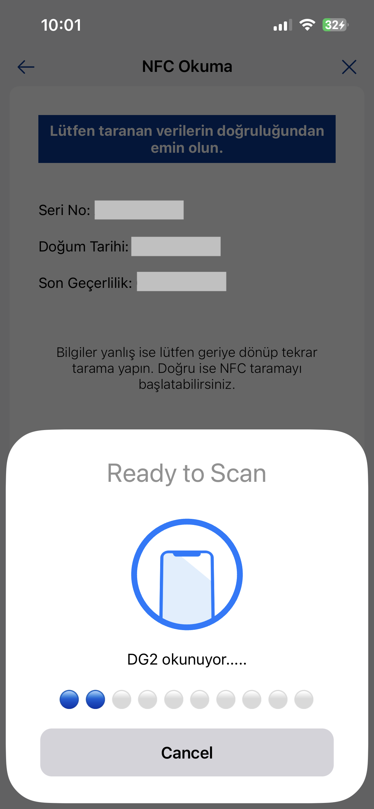
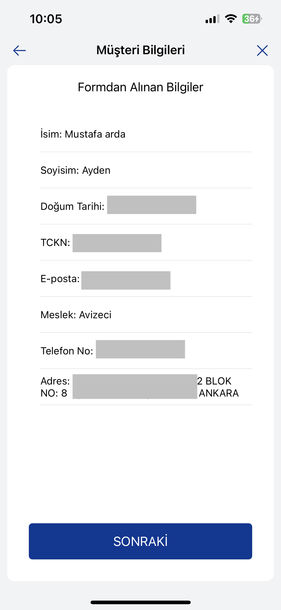

# TacirlerSDK
[](https://cocoapods.org/)

## Requirements
- +iOS 13.0 

## Installation
TacirlerSDK is available through [CocoaPods](https://cocoapods.org). To install
it, simply add the following line to your Podfile:

```ruby
pod 'TacirlerSDK'
```
## Configuration
- In target app select `Signing & Capabilities` tab and click `+Capability` button and add `Near Field Communication Tag Reading` capability.
- Add your Info.plist file necessary permissions;
```
<!--
FOR NFC
-->
<key>com.apple.developer.nfc.readersession.iso7816.select-identifiers</key>
<array>
    <string>A0000002471001</string>
</array>
<key>NFCReaderUsageDescription</key>
<string>Permission string</string>

<!--
FOR Camera
-->
<key>NSCameraUsageDescription</key>
<string>Permission string</string>
<key>NSMicrophoneUsageDescription</key>
<string>Permission string</string>

```
- Make sure you have these lines in your `.entitlements` file;
```
<dict>
    <key>com.apple.developer.nfc.readersession.formats</key>
    <array>
        <string>TAG</string>
    </array>
</dict>
```
## Usage
First import the SDK;
```swift
import TacirlerSDK
```
Then, create a view controller object to start cycle;
```swift
let vc = TacirlerSDKViewController()
```
Then, handover this view controller to a button. For example;
```swift
@objc func nextClicked() {
    vc.modalTransitionStyle = .coverVertical
    vc.modalPresentationStyle = .fullScreen
    present(vc, animated: true)        
}
```
- `x` buttons on the screen is to `dismiss` the SDK. Also, when cycle ends, `home` button is to `dismiss` SDK.

## SDK Flow
- KVKK Approval Screen

User needs to check both checkmark to proceed.

- KVKK Policy and Commercial and Electronic Message Screens
 

- MASAK Statement Screen


- Daily and Monthly Notifications Screen

User needs to check checkmark to proceed.

- NFC Availability Check Screen

In this screen NFC Availability control should be done, otherwise, user cannot proceed.

- Form Screen

User needs to fill the form to proceed

- Questionnaire Screen

User needs to choose one option to proceed. If they choose other or "Tacirler Investment Personal", user needs to fill text field.

- Phone Number Screen


- SMS OTP Code Screen


- MRZ Scanner Screen

TR Identity card should be shown to the camera to proceed.

- NFC Reader Screen

TR Identity card should be shown to backside of the phone to proceed.

- Information Check Screen


- Selfie Screen


- Selfie Check Screens


- Address Verification Screens


1. Verification with Place of Residence


QR Code that is on the place of residence form can be scanned.

2. Verification with Address No from E-devlet
 

- Client Information Screen


- Video Call Screens


- Result Screens

Application failed


Application succeded


## Author
Papilon Savunma
